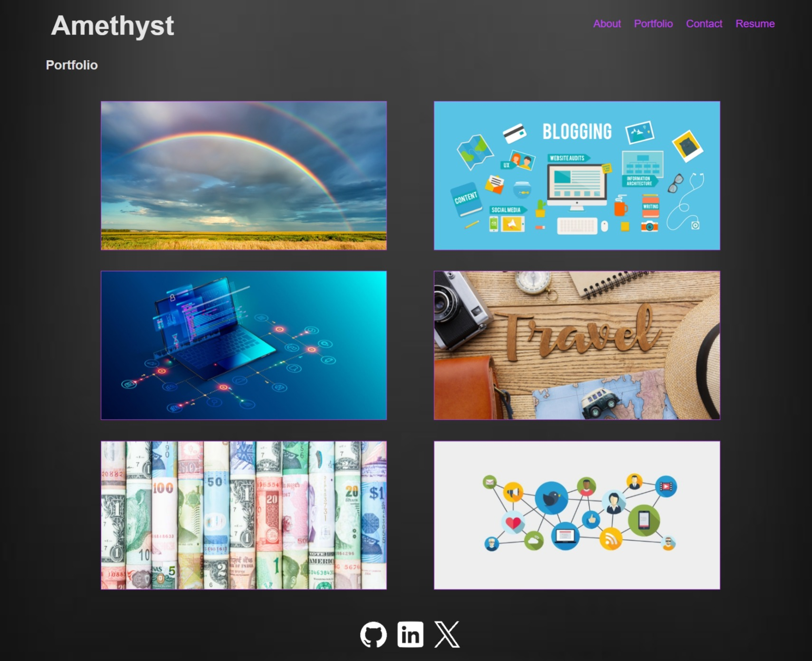
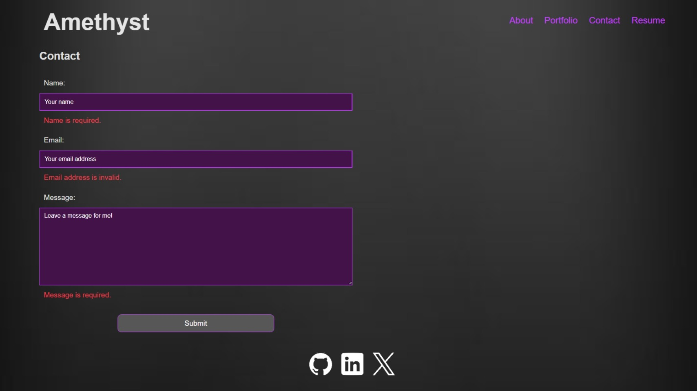
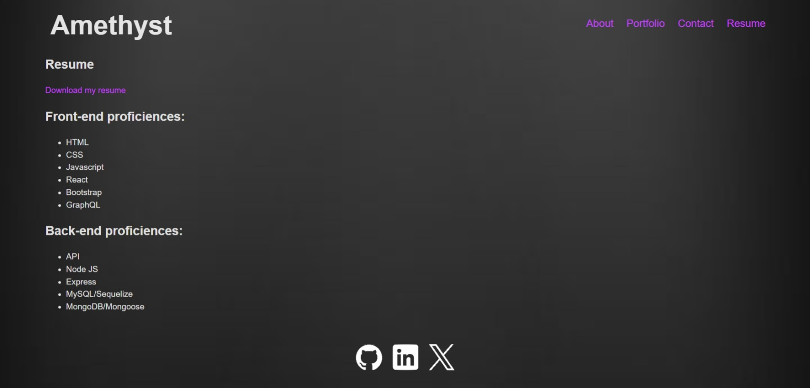

#React Portfolio

## Description
    
A single page application for web developer to showcase built project portfolio. There is a form available to Contact the developer and a Resume page that lists the developer's capabilities. Users can also download a pdf copy of the developer's resume.
The footer at the bottom of the page also has the developer's social media accounts.
    
## Table of Contents
    
- [Installation](#installation)
- [Usage](#usage)
- [Credits](#credits)
- [License](#license)
- [How to Contribute](#how-to-contribute)
- [Tests](#tests)
    
## Installation
    
Open url link https://65ad265d5fea0467e280776a--amethyst-lyre.netlify.app/ in a browser such as Google Chrome, Firefox or Edge etc.

## Usage

Portfolio page
 

Contact page

 

Resume pagee

 

    
## Credits
NA

## License
 
This project is licensed under the MIT License - see the [LICENSE.md](license) file for details    
 
## How to Contribute
    
Feel free to contribute your ideas or bug fixes for this project by raising a new issue or new pull request.
    
## Tests
NA
